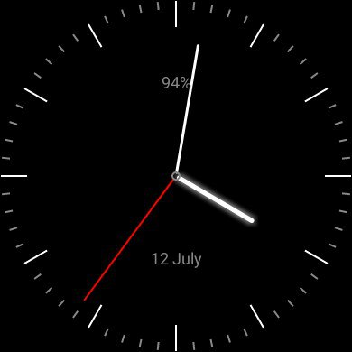
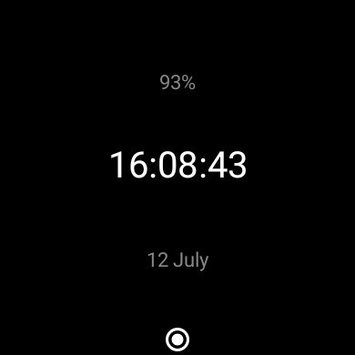

#SimpleWatchFace

A combination analog and digital watchface with an emphasis on saving battery life.

Both analog and digital watchfaces include the date and battery life percentage of the watch.
The analog watchface has a smooth second hand (updates at 20hz).

